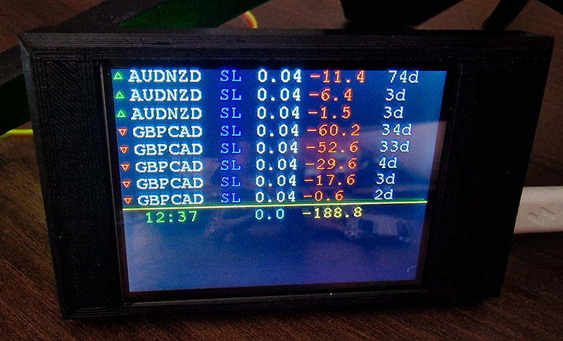

# Forex ESP32 TFT Expert data exchange.

Connect to Metatrader 4 Expert by socket, send request and receive for the data to be displayed on the screen TFT every x seconds. 


## In my case is 2 config, TFT

``` C++
Send serial=1 in WebSerial for view DEBUG

```

For access WebSerial go to http://controller_ip/webserial

Next implementation tasks:

- [x] AP WiFi Portal.
- [ ] WebServer View Forex data.
- [x] Time Sync and scenaries.
- [ ] Send data to Home Assistant.
- [x] WebSerial control. Send "cmd" to view commands. 



